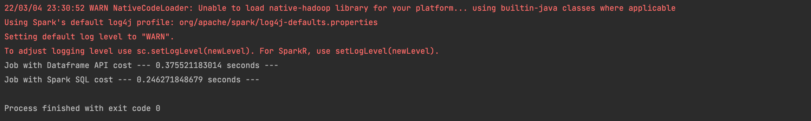

La fonction de transformation des données a été refactorisée avec du Spark SQL [ici](https://github.com/reda-mouffok/BigQuery-Github-Analysis/blob/SQL_test_branch/src/Processing/BigQuerySparkProcessing.py#L129) 

D'aprés les résultats du test, le Spark SQL est plus rapide que les Dataframe API, mais ca reste un test et ne peut confiremer cette théorie. 

