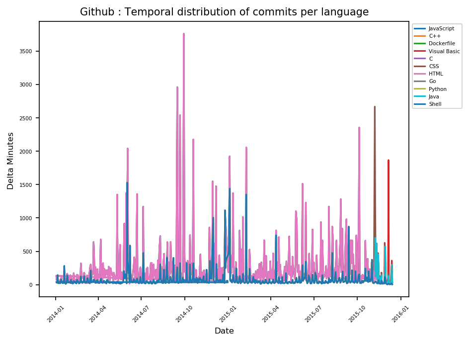

# BigQuery Github Analysis

This project aims to extract github public data from BigQuery and providing a temporal distribution of GitHub commits per language using PySpark and Docker.
As well, this project provides a comparison between using DataFrame API or SQL API on Apache Spark V3.3.0. 

## Requirement 

Before running the program, install Docker. 

Enable Google Cloud BigQuery API on your GCP account, then create a Service Account for BigQuery API to grant permission to your Python script and export the key as json file.
After, put the json file in the credentials' folder at the root of the project.

## Configuration

**Spark :** you can add spark session configurations in the file  `/conf/app.yaml`.

**Reading & saving data :** Due to cost, reading tables from BigQuery is done once, and the table is persisted in a folder, the function `read_public_data` can be used to read any public table present in BigQuery, you should provide the following arguments :
- Spark : The SparkSession.
- Project : The project name on GCP.
- Database : The database name containing the public data.
- Table : The table name on BigQuery, it can be replaced by an expression.
- Columns (optional): The list of the selected columns ( by default select all ), you can add as well bigquery functions.
- Condition (optional) : The condition added to the query ( by default no condition is provided ).

**Display :** you can specify some filters on the `main.py` file as follows : 
- max_date : The maximum date of the commits.
- min_date : The maximum date of the commits.
- format : The format of the date (ex: "YYYY-MM-DD" or  "YYYY-MM" ).
- language_list : A list of the languages that you want to display.

## Running 

To do so, create two folders : 

- **credentials :** where you should put the credential json file downloaded from your GCP account. 
- **result :** where the result graph should be created after running the job. 

First give the permission to execute the run file with the following command :  `chmod +x bin/runJob.sh`

Then run the script with `./bin/runjob/`, this script should build a docker image of the project with the different packages, and run the concerned image by providing the logs.

## Display the result

The analysis result is saved to an image format under the directory `result`

**Exemple :** 

